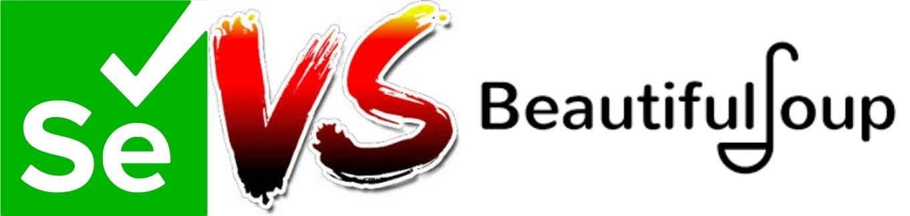
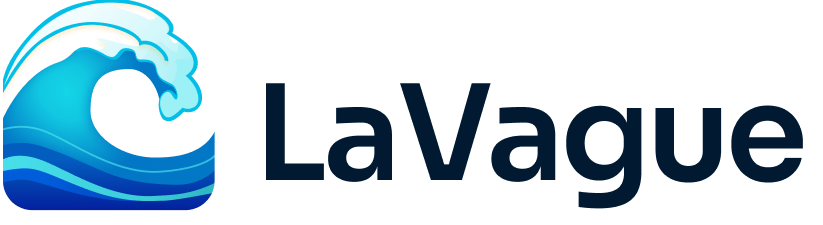

# [Atelier Scraping](https://github.com/Mastocodeur/Tutorial_Scraping/)

Atelier pour découvrir deux modules python de scraping : Selenium et BeautifulSoup.

    

🌏
[**Anglais**](https://github.com/Mastocodeur/tuto_scraping/blob/main/README.md) |
Français |

## Table des Matières

1. [Qu'est-ce que le scraping ?](#le-scraping-quest-ce-que-cest-)
2. [Législation autour du scraping](#législation-autour-du-scraping)
3. [Selenium vs BeautifulSoup](#selenium-vs-beautifulsoup)
4. [Les évolutions de Sélénium](#les-évolutions-de-sélénium)
5. [Introduction au HTML](#introduction-au-html)
6. [Les différentes options du driver](#les-différentes-options-dun-driver)
7. [Les différentes façons de localiser des éléments Web](#les-différentes-façon-de-localiser-des-éléments-web)
8. [Les parsers de BeautifulSoup](#les-parsers-de-beautifulsoup)
9. [Avenir du scraping : LaVague](#avenir-du-scraping--lavague)
10. [Crawling et Robots.txt](#crawling-et-robotstxt)
11. [Sources et documentation](#sources-et-documentation)

## Le scraping, qu'est-ce que c'est ?

Le scraping, ou "web scraping", est une technique utilisée pour extraire automatiquement des données à partir de sites web. Cette méthode permet de récupérer des informations structurées ou semi-structurées disponibles sur des pages web, que l'on peut ensuite analyser, traiter ou stocker pour divers usages. 

Le scraping permet également d'automatiser des tâches sur un site. 

Il existe plusieurs module python permettant de faire du scraping : `BeautifulSoup`, `Selenium`, `Scrapy`, `Requests`, `Octoparse`, etc.

Dans cet atelier, nous exploiterons `BeautifulSoup` en combinaison avec `Requests`, et `Selenium` au cours des différents modules. Ces deux outils offrent une vaste gamme de fonctionnalités pour le scraping et seront donc de véritables portes d'entrée vers ce domaine.

Pour les projets de grande envergure, on utilise souvent des frameworks comme `Scrapy`, qui permettent de répartir le travail de scraping sur plusieurs machines et de gérer de grandes quantités de données.

## Législation autour du scraping

Le scraping web est généralement autorisé dans les cas suivants :
- Les données extraites sont des données accessibles au public.
- Les informations recueillies ne sont pas protégées par un login.

Bien que la technique elle-même ne soit pas illégale, son utilisation peut enfreindre les conditions d'utilisation de certains sites.

Il est important d'être prudent lorsque l'on se lance dans une tâche de scraping, notamment vis-à-vis des termes de service, des données protégées par le droit d'auteur et des données personnelles. Les conditions d'utilisation des sites doivent être respectées, car les données personnelles sont généralement protégées par les lois sur la protection des données.

Il faut également prendre en compte l'impact sur les serveurs, notamment en cas de scraping intensif. Il est recommandé d'utiliser des techniques comme le "rate limiting" pour limiter le nombre de requêtes envoyées en un temps donné.

En droit de la concurrence, le web scraping peut être qualifié d'acte de concurrence déloyale. 

La CNIL a par exemple condamné la société Nestor à une amende de 20000 euros car elle avait construit sa base de prospects en ayant recours à la pratique de web scraping à partir de données accessibles sur le réseau social professionnel Linkedin (pour plus d'informations, voir les articles mentionnés dans la partie [Sources et documentation](#sources-et-documentation)).

## Selenium vs BeautifulSoup

    

**Selenium** est utile pour les pages web dynamiques où le contenu est généré via JavaScript, nécessitant des interactions utilisateur telles que les clics, le défilement, ou la saisie de texte.

**BeautifulSoup** est une bibliothèque Python utilisée principalement pour parser (analyser) des documents HTML et XML. Elle est utile pour extraire des données structurées à partir de pages web statiques.

## Les évolutions de Sélénium

Le module Sélénium est probablement l'un des modules python qui a connu le plus de modification au cours du temps. 
Ces modifications ont changé la manière de l'utiliser. Il est important d'avoir une vision globale de ces évolutions pour comprendre les différentes problématiques qu'a connu ce module et aussi pouvoir comprendre les différents forums et codes qui circulent sur internet. 

### Selenium 1.x (avant 2011)

La première version de Sélénium nécessitait un serveur pour interagir avec les navigateurs. La gestion des drivers n'était pas encore une préoccupation majeure, car Selenium RC interagissait directement avec les navigateurs via JavaScript.

### Selenium 2.x (2011-2016)

Dans cette version, on introduit Selenium WebDriver. Cette version marquait un changement significatif en permettant une interaction directe avec les navigateurs à travers des API spécifiques appelées "drivers". Chaque navigateur (Chrome, Firefox, etc.) nécessitait un driver spécifique pour fonctionner.

Le code pour utiliser un driver et donc se connecter à un site ressemblait à ça : 

    driver = webdriver.Chrome(executable_path='/path/to/chromedriver')

### Selenium 3.x (2016-2021)

Les utilisateurs devaient encore télécharger manuellement les drivers et définir le chemin dans le code. 
 
Cependant, des outils tiers comme `webdriver-manager` ou `chromedriver-autoinstaller` ont commencé à émerger, facilitant la gestion automatique des drivers.

Vers la fin de cette période (version 3.141.0 notamment), des bibliothèques comme `WebDriverManager` en Java ou `webdriver_manager` en Python ont commencé à gagner en popularité. Elles permettaient de télécharger automatiquement le bon driver sans que l'utilisateur ait à gérer manuellement les chemins d'accès :

    from webdriver_manager.chrome import ChromeDriverManager
    driver = webdriver.Chrome(ChromeDriverManager().install())

### Selenium 4.x (dès 2021)

Selenium 4 a apporté de nombreuses améliorations, y compris une API mise à jour et des fonctionnalités pour les tests sans serveur.

La version 4.6.0 de Selenium, publiée en octobre 2022, a introduit une fonctionnalité majeure qui automatise entièrement la gestion des drivers. Selenium télécharge et configure automatiquement le bon driver pour le navigateur spécifié, sans besoin d'une bibliothèque externe. Le code devient : 

    from selenium import webdriver
    driver = webdriver.Chrome()

Pour suivre les évolutions de ce module python et rester à jour sur son scraping : [Les différentes mises à jour de Selenium](https://github.com/SeleniumHQ/selenium/blob/trunk/py/CHANGES)

## Introduction au HTML
Scraper nécessite de savoir interpréter les codes sources des pages web, et donc comprendre le HTML.

Voici un petit [Formulaire HTML](activities_in_french/formulaire_html.md). Il permet rapidemment d'apprendre ou se remémorer les balises principales permettant de lire du HTML et d'ainsi repérer les différents éléments d'une page web.

## Les différentes options d'un driver

Quand on utilise Selenium, il est important de connaitre les options du driver.

Voici un formulaire qui présente un état de l'art des principales options d'un driver : [Formulaire Driver](activities_in_french/formulaire_options.md)

## Les différentes façon de localiser des éléments Web 

Pour interagir avec des éléments sur une page web, il est essentiel de savoir comment les localiser. Il existe plusieurs méthodes pour identifier ces éléments dans le DOM (Document Object Model) d'une page web :

- **ID** :  L'attribut `id` est unique pour chaque élément, ce qui en fait un moyen rapide et précis de localiser un élément.

- **NAME** : L'attribut `name` est souvent utilisé dans les formulaires et permet de cibler des éléments basés sur leur nom.

- **XPATH** :  `XPath` est un langage qui permet de naviguer dans la structure du document XML/HTML pour trouver un élément selon son emplacement relatif dans l'arbre DOM.

- **LINK_TEXT** : Cette méthode localise un lien (balise `<a>`) en fonction du texte visible qu'il contient.

- **PARTIAL_LINK_TEXT** : Similaire à LINK_TEXT, mais permet de localiser un lien en utilisant une partie seulement du texte visible.

- **TAG_NAME** : Permet de cibler les éléments par leur nom de balise HTML, comme `
`, `<input>`, etc.

- **CLASS_NAME** : Cette méthode localise les éléments en fonction de la valeur de leur attribut `class`, utile pour cibler des éléments avec un style ou une fonctionnalité spécifique.

- **CSS_SELECTOR** : Un sélecteur CSS permet de cibler des éléments en utilisant des règles similaires à celles utilisées en CSS pour le style des éléments.

Chacune de ces méthodes offre un niveau de précision et de flexibilité différent, en fonction du contexte et de la structure de la page web à analyser.

Précision : **XPATH** et **CSS_SELECTOR** sont deux options qui permettent de cibler un ou plusieurs éléments avec plusieurs classes.

## Les parsers de BeautifulSoup

Un parser est un composant ou un outil qui analyse un document HTML ou XML et le décompose en une structure que BeautifulSoup peut manipuler et interroger. Concrètement, BeautifulSoup utilise un parser pour lire le contenu d'une page web (HTML/XML) et le convertir en un arbre d'objets Python, permettant ainsi d'extraire et de manipuler facilement des données spécifiques à partir du document.

Voici quelques types de parsers que vous pouvez utiliser avec BeautifulSoup :

- `html.parser` : C'est le parser HTML intégré à Python. Il est rapide, ne nécessite pas d'installation supplémentaire. Cependant, il est moins rapide que `lxml` et moins tolérant qu'`html5lib`.

- `lxml` : Un parser externe qui doit être installé séparément. Il est très rapide et tolérant aux erreurs, capable de traiter à la fois le HTML et le XML. Il est souvent préféré pour sa performance. Son inconvénient principal est qu'il nécessite une dépendance externe en C.

- `lxml-xml` : C'est un parser très rapide, et le seul actuellement supporté pour XML. Comme le parser HTML de `lxml`, il nécessite également une dépendance externe en C.

- `html5lib` : Ce parser est plus complet et conforme aux standards du HTML5. Il analyse les documents de manière plus proche de la façon dont un navigateur le ferait, mais il est plus lent et nécessite également une installation supplémentaire. Son principal inconvénient est sa lenteur, en plus de nécessiter une dépendance externe en Python.

## Avenir du scraping : LaVague

Après avoir suivi les évolutions de Selenium ces dernières années, il est légitime de se demander quel sera l'avenir du scraping.

L'une des grandes problématiques du scraping réside dans l'évolution constante des sites internet. En effet, les programmes Python utilisés pour le scraping sont fragiles, car la structure des sites web peut changer fréquemment, que ce soit par des modifications des noms de balises, des classes CSS, ou d'autres éléments.

L'émergence de l'intelligence artificielle joue alors un rôle clé dans l'évolution du scraping.

C'est dans cette perspective que s'inscrit le module [lavague.ai](https://github.com/lavague-ai).

  

LaVague est une technologie de scraping de nouvelle génération qui combine des techniques avancées d'apprentissage automatique avec des méthodes traditionnelles de scraping. Elle permet une extraction de données plus intelligente, en tenant compte non seulement de la structure des pages web, mais aussi du contexte et de la sémantique des informations qu'elles contiennent.

C'est entre autres l'une des solutions qui, à terme, permettra de créer des scripts beaucoup plus robustes face aux évolutions des différentes pages web à scraper.

LaVague permet ainsi une adaptabilité en temps réel aux changements de structure des sites web.

Ce module permet également une automatisation poussée des tâches de scraping, avec des workflows personnalisables qui peuvent être ajustés en fonction des besoins spécifiques de l'utilisateur.

L'un des cas les plus concrets est présenté ici : [Remplir des formulaires](https://docs.lavague.ai/en/latest/docs/use-cases/forms/)

## Crawling et Robots.txt

Cette dernière partie est une ouverture. Elle permet d'aborder la notion de crawling et d'établir une distinction claire entre crawling et scraping.
### Crawling
Le crawling ou indexation naturelle désigne le processus que les grands moteurs de recherche comme Google entreprennent lorsqu’ils envoient leurs robots d'indexation, comme Googlebot, parcourir le réseau pour indexer le contenu Internet. 

Voici quelques différences notables :

- Le scraper se fait pour un navigateur web tandis qu'un robot d'indexation indique clairement son intenton et ne cherche pas à masquer son identité.

- Les scrapers peuvent effectuer des actions avancées, comme remplir des formulaires ou adopter un comportement permettant d'accéder à certaines parties d’un site web, ce que les robots d'indexation ne font généralement pas.

- Les scrapers ignorent souvent le fichier robots.txt, conçu pour guider les robots d'indexation sur les données à analyser et les zones du site à éviter. Contrairement aux robots d'indexation, ces extracteurs ciblent délibérément le contenu, même celui explicitement marqué à ignorer.

### Robots.txt
Le protocole d'exclusion des robots, plus connu sous le nom de robots.txt, est une convention visant à empêcher les robots d'exploration (web crawlers) d'accéder à tout ou une partie d'un site web.

Pour accéder à ce fichier, il s'agit de taper : url_racine/robots.txt ou d'ajouter `/robots.txt` à la fin de l'url racine d'un site que vous consultez.

Le fichier contient une liste de ressources du site qui ne sont pas censées être explorées par les moteurs de recherches.

Pour plus de détails : [Robots.txt](https://robots-txt.com/)

## Sources et documentation

- [Tout sur le web scraping](https://kinsta.com/fr/base-de-connaissances/web-scraping/)

- [Comprendre l'environnement du scraping](https://datascientest.com/front-end-vs-back-end)

- [Qu'est-ce que le scraping de données](https://www.cloudflare.com/fr-fr/learning/bots/what-is-data-scraping/)

- [Web scraping : est-ce légal](https://www.captaincontrat.com/protection-des-creations/cgv-cgu-cga/web-scraping-est-ce-legal-me-marcotte)

- [Le web scraping est-il légal ?](https://www.iubenda.com/fr/help/111962-le-web-scraping-est-il-legal-ce-que-vous-devez-savoir#:~:text=La%20l%C3%A9galit%C3%A9%20du%20web%20scraping&text=Ne%20soyez%20pas%20trop%20enthousiaste,pas%20prot%C3%A9g%C3%A9es%20par%20un%20login)

- [Le cas Nestor (1)](https://www.alerionavocats.com/condamnation-societe-nestor-prospection-commerciale-fondee-interet-legitime-responsable-traitement-enseignements-tirer/)

- [Le cas Nestor (2)](https://www.plravocats.fr/blog/data-protection-rgpd/la-societe-nestor-sanctionee-par-la-cnil)

- [Présentation du fichier robots.txt](https://developers.google.com/search/docs/crawling-indexing/robots/intro?hl=fr)

- [Tableau de disponibilité Chrome](https://developer.chrome.com/docs/chromedriver/downloads?hl=fr)

- [Robots.txt](https://robots-txt.com/)

- [Choisir le navigateur](https://vedantkekan.medium.com/how-to-get-rid-of-choose-your-search-engine-dialog-in-chrome-v-127-on-selenium-test-run-ec46643a3228)

- [Eviter la détection du BOT](https://www.zenrows.com/blog/selenium-avoid-bot-detection#how-anti-bots-work)

- [Documentation BeautifulSoup](https://beautiful-soup-4.readthedocs.io/en/latest/)

- [Parsers BeautifuSoup](https://beautiful-soup-4.readthedocs.io/en/latest/index.html?highlight=parser#installing-a-parser)

- [Github de Selenium](https://github.com/SeleniumHQ)

- [Documentation Selenium](https://selenium-python.readthedocs.io/)

- [Documentation Selenium 4.22.0](https://www.selenium.dev/selenium/docs/api/py/api.html)

