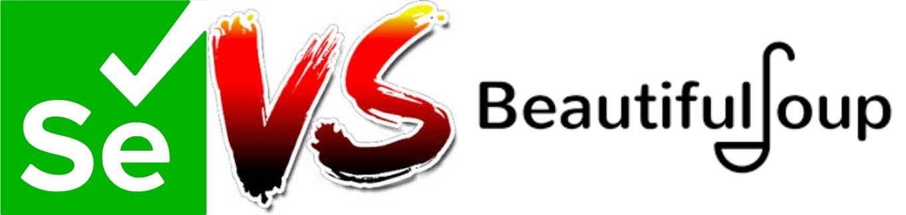
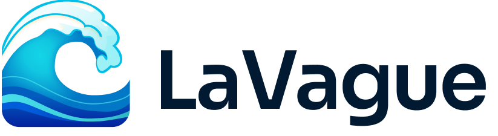

# [Scraping Workshop](https://github.com/Mastocodeur/Tutorial_Scraping/)

Workshop to discover two Python modules for scraping: Selenium and BeautifulSoup.

    

🌏
English |
[**French**](https://github.com/Mastocodeur/scraping-workshop/blob/main/README.fr.md) |

---

## Table of Contents

1. [What is scraping](#what-is-scraping)
2. [Legislation surrounding scraping](#legislation-surrounding-scraping)
3. [Selenium vs BeautifulSoup](#selenium-vs-beautifulsoup)
4. [Selenium's evolution](#changes-to-selenium)
5. [Introduction to HTML](#introduction-to-html)
6. [The different driver options](#the-different-driver-options)
7. [The different ways of locating web elements](#the-different-ways-of-locating-web-elements)
8. [BeautifulSoup's parsers](#beautifulsoup-parsers)
9. [The future of scraping: LaVague](#future-of-scraping-lavague)
10. [Crawling et Robots.txt](#crawling-and-robotstxt)
11. [Sources and documentation](#sources-and-documentation)

## What is Scraping?

Web scraping is a technique used to automatically extract data from websites. This method makes it possible to retrieve structured or semi-structured information from web pages, which can then be analysed, processed or stored for various uses. 

Scraping can also be used to automate tasks on a site. 

There are several python modules for scraping: `BeautifulSoup`, `Selenium`, `Scrapy`, `Requests`, `Octoparse`, etc.

In this workshop, we will be using `BeautifulSoup` in combination with `Requests`, and `Selenium` in the various modules. These two tools offer a wide range of features for scraping and will therefore be real gateways into this field.

For large-scale projects, frameworks such as `Scrapy` are often used, which allow the scraping work to be spread over several machines and large quantities of data to be managed.

## Legislation surrounding scraping

Web scraping is generally authorised in the following cases:
- The data extracted is publicly accessible data.
- The information collected is not protected by a login.

Although the technique itself is not illegal, its use may infringe the terms of use of certain sites.

It is important to be cautious when embarking on a scraping task, particularly with regard to terms of service, data protected by copyright and personal data. The site's terms of use must be respected, as personal data is generally protected by data protection laws.

The impact on servers must also be taken into account, particularly in the case of intensive scraping. It is advisable to use techniques such as ‘rate limiting’ to limit the number of requests sent in a given time.

In competition law, web scraping can be qualified as an act of unfair competition. 

For example, the CNIL fined Nestor 20,000 euros for having built up its database of prospective customers by web scraping data accessible on the professional social network Linkedin (for more information, see the articles mentioned in the section [Sources and documentation](#sources-and-documentation)).

## Selenium vs BeautifulSoup

    

**Selenium** is useful for dynamic web pages where content is generated via JavaScript, requiring user interaction such as clicking, scrolling or text input.

**BeautifulSoup** is a Python library used mainly for parsing HTML and XML documents. It is useful for extracting structured data from static web pages.

## Changes to Selenium

The Selenium module is probably one of the Python modules that has undergone the most changes over time. 
These modifications have changed the way it is used. It is important to have an overview of these changes in order to understand the various problems this module has encountered and also to be able to understand the various forums and codes circulating on the Internet. 

### Selenium 1.x (before 2011)

The first version of Selenium required a server to interact with browsers. Driver management was not yet a major concern, as Selenium RC interacted directly with browsers via JavaScript.

### Selenium 2.x (2011-2016)

This version introduced Selenium WebDriver. This version marked a significant change by enabling direct interaction with browsers via specific APIs called ‘drivers’. Each browser (Chrome, Firefox, etc.) required a specific driver to function.

The code to use a driver and connect to a site looked like this: 

    driver = webdriver.Chrome(executable_path=‘/path/to/chromedriver’)

### Selenium 3.x (2016-2021)

Users still had to download drivers manually and define the path in the code. 
 
However, third-party tools such as `webdriver-manager` or `chromedriver-autoinstaller` began to emerge, making it easier to manage drivers automatically.

Towards the end of this period (version 3.141.0 in particular), libraries such as `WebDriverManager` in Java or `webdriver_manager` in Python began to gain in popularity. These libraries enabled the right driver to be downloaded automatically, without the user having to manually manage the access paths:

    from webdriver_manager.chrome import ChromeDriverManager
    driver = webdriver.Chrome(ChromeDriverManager().install())

### Selenium 4.x (from 2021)

Selenium 4 has brought many improvements, including an updated API and features for serverless testing.

Selenium 4.6.0, released in October 2022, introduced a major feature that fully automates driver management. Selenium automatically downloads and configures the right driver for the specified browser, without the need for an external library. The code becomes : 

    from selenium import webdriver
    driver = webdriver.Chrome()

To follow developments in this python module and keep up to date with its scraping: [Selenium updates](https://github.com/SeleniumHQ/selenium/blob/trunk/py/CHANGES)

## Introduction to HTML
Scraping requires you to know how to interpret the source code of web pages, and therefore to understand HTML.

Here's a little [HTML Form](activities_in_english/form_html.md). It's a quick way of learning or remembering the main tags used to read HTML and identify the different elements of a web page.

## The different driver options

When using Selenium, it's important to know the driver options.

Here's a form that provides an overview of the main driver options: [Driver form](activities_in_english/form_options.md)

## The different ways of locating web elements 

To interact with elements on a web page, it is essential to know how to locate them. There are several methods for identifying these elements in the DOM (Document Object Model) of a web page:## The different ways of locating web elements :

- **ID** : The id attribute is unique for each element, making it a quick and precise way to locate an element.

- **NAME** : The name attribute is often used in forms and allows targeting elements based on their name.

- **XPATH** : XPath is a language that allows navigating the XML/HTML document structure to find an element based on its relative position in the DOM tree.

- **LINK_TEXT** : This method locates a link (an `<a>` tag) based on the visible text it contains.

- **PARTIAL_LINK_TEXT** : Similar to LINK_TEXT, but it allows locating a link using only part of the visible text.

- **TAG_NAME** : Allows targeting elements by their HTML tag name, such as `
`, `<input>`, etc.

- **CLASS_NAME** : This method locates elements based on the value of their class attribute, useful for targeting elements with a specific style or functionality.

- **CSS_SELECTOR** : A CSS selector allows targeting elements using rules similar to those used in CSS for styling elements.

Each of these methods offers different levels of precision and flexibility, depending on the context and structure of the web page being analyzed.

Note : **XPATH** and **CSS_SELECTOR** are two options that allow targeting one or more elements with multiple classes.

## BeautifulSoup Parsers

A parser is a component or tool that analyzes an HTML or XML document and breaks it down into a structure that BeautifulSoup can manipulate and query. Essentially, BeautifulSoup uses a parser to read the content of a web page (HTML/XML) and convert it into a tree of Python objects, making it easy to extract and manipulate specific data from the document.

Here are some types of parsers you can use with BeautifulSoup:

- `html.parser`: This is the built-in HTML parser in Python. It is fast and does not require any additional installation. However, it is slower than lxml and less forgiving than html5lib.

- `lxml` : An external parser that needs to be installed separately. It is very fast and error-tolerant, capable of handling both HTML and XML. It is often preferred for its performance. Its main drawback is that it requires an external C dependency.

- `lxml-xml` : This is a very fast parser and the only one currently supported for XML. Like the lxml HTML parser, it also requires an external C dependency.

- `html5lib` : This parser is more comprehensive and adheres to HTML5 standards. It processes documents in a way that is closer to how a browser would, but it is slower and also requires additional installation. Its main disadvantage is its slowness, in addition to requiring an external Python dependency.

## Future of Scraping: LaVague

After observing the developments in Selenium over the past few years, it is reasonable to wonder about the future of web scraping.

One of the major challenges in web scraping lies in the constant evolution of websites. Python programs used for scraping are fragile because the structure of websites can frequently change, whether through modifications to tag names, CSS classes, or other elements.

The emergence of artificial intelligence plays a key role in the evolution of web scraping.

This is where the [lavague.ai](https://github.com/lavague-ai) module comes into play.

  

LaVague is a next-generation scraping technology that combines advanced machine learning techniques with traditional scraping methods. It allows for more intelligent data extraction by taking into account not only the structure of web pages but also the context and semantics of the information they contain.

This is one of the solutions that, in the long term, will enable the creation of much more robust scripts in the face of evolving web pages to be scraped.

LaVague thus enables real-time adaptability to changes in the structure of websites.

This module also allows for advanced automation of scraping tasks, with customizable workflows that can be adjusted according to the specific needs of the user.

One of the most concrete use cases is presented here: [Filling out forms](https://docs.lavague.ai/en/latest/docs/use-cases/forms/).

## Crawling and Robots.txt

This final section is an introduction to the concept of crawling and provides a clear distinction between crawling and scraping.

### Crawling
Crawling, or natural indexing, refers to the process that major search engines like Google undertake when they send out their indexing bots, such as Googlebot, to browse the web and index its content.

Here are some notable differences:

- Scraping is done for a web browser, while a crawling bot clearly indicates its intention and does not seek to disguise its identity.

- Scrapers can perform advanced actions, such as filling out forms or adopting behaviors that allow access to certain parts of a website, which indexing bots typically do not do.

- Scrapers often ignore the robots.txt file, which is designed to guide indexing bots on which data to analyze and which areas of the site to avoid. Unlike indexing bots, these scrapers deliberately target content, even that which is explicitly marked to be ignored.

### Robots.txt
The robots exclusion protocol, more commonly known as robots.txt, is a convention used to prevent web crawlers from accessing all or part of a website.

To access this file, you simply need to type: root_url/robots.txt or add /`robots.txt` to the end of the root URL of a site you are visiting.

The file contains a list of site resources that are not meant to be explored by search engines.

For more details: [Robots.txt](https://robots-txt.com/)

## Sources and Documentation

- [All About Web Scraping](https://kinsta.com/fr/base-de-connaissances/web-scraping/)

- [Understanding the Scraping Environment](https://datascientest.com/front-end-vs-back-end)

- [What is Data Scraping](https://www.cloudflare.com/fr-fr/learning/bots/what-is-data-scraping/)

- [Web Scraping: Is It Legal?](https://www.captaincontrat.com/protection-des-creations/cgv-cgu-cga/web-scraping-est-ce-legal-me-marcotte)

- [Is Web Scraping Legal?](https://www.iubenda.com/fr/help/111962-le-web-scraping-est-il-legal-ce-que-vous-devez-savoir#:~:text=La%20l%C3%A9galit%C3%A9%20du%20web%20scraping&text=Ne%20soyez%20pas%20trop%20enthousiaste,pas%20prot%C3%A9g%C3%A9es%20par%20un%20login)

- [The Nestor Case (1)](https://www.alerionavocats.com/condamnation-societe-nestor-prospection-commerciale-fondee-interet-legitime-responsable-traitement-enseignements-tirer/)

- [The Nestor Case (2)](https://www.plravocats.fr/blog/data-protection-rgpd/la-societe-nestor-sanctionee-par-la-cnil)

- [Introduction to the Robots.txt File](https://developers.google.com/search/docs/crawling-indexing/robots/intro?hl=fr)

- [Chrome Availability Table](https://developer.chrome.com/docs/chromedriver/downloads?hl=fr)

- [Robots.txt](https://robots-txt.com/)

- [Choosing the Browser](https://vedantkekan.medium.com/how-to-get-rid-of-choose-your-search-engine-dialog-in-chrome-v-127-on-selenium-test-run-ec46643a3228)

- [Avoiding Bot Detection](https://www.zenrows.com/blog/selenium-avoid-bot-detection#how-anti-bots-work)

- [BeautifulSoup Documentation](https://beautiful-soup-4.readthedocs.io/en/latest/)

- [BeautifulSoup Parsers](https://beautiful-soup-4.readthedocs.io/en/latest/index.html?highlight=parser#installing-a-parser)

- [Selenium GitHub](https://github.com/SeleniumHQ)

- [Selenium Documentation](https://selenium-python.readthedocs.io/)

- [Selenium 4.22.0 Documentation](https://www.selenium.dev/selenium/docs/api/py/api.html)
